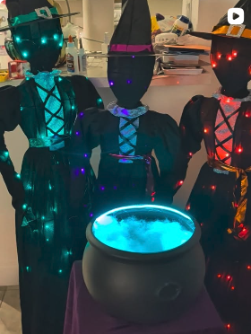

# Interactive Halloween Cauldron

An interactive prop built on a Raspberry Pi.
Drop some items into the cauldron and an IR beam break starts the sequence: the camera takes a photo, a vision model writes a three-line spell about what it sees, and three text-to-speech "witch" voices recite it with the LED ring set to each witch's color.
See [Materials](docs/materials.md) for the full parts list.

## Table of Contents

- [Modes](#modes)
- [Software Layout](#software-layout)
- [Setting Up](#setting-up)
  - [Step 1: Setting Up Raspberry Pi OS](#step-1-setting-up-raspberry-pi-os)
  - [Step 2: Installing Dependencies and API Keys](#step-2-installing-dependencies-and-api-keys)
  - [Step 3: Testing Audio Playback](#step-3-testing-audio-playback)
  - [Step 4: Testing Text-to-Speech](#step-4-testing-text-to-speech)
  - [Step 5: Testing the Webcam](#step-5-testing-the-webcam)
  - [Step 6: Testing the Vision Model](#step-6-testing-the-vision-model)
  - [Step 7: Testing the IR Break-Beam Sensor](#step-7-testing-the-ir-break-beam-sensor)
  - [Step 8: Testing the LED Ring](#step-8-testing-the-led-ring)
  - [Step 9: Testing the Stage Actuator](#step-9-testing-the-stage-actuator)
  - [Step 10: Running the End-to-End Smoke Test](#step-10-running-the-end-to-end-smoke-test)

## Modes

The controller takes `--mode react` (default), `--mode story`, or `--mode request`.

**react** — the witches conjure a spell about whatever the mortal drops in.
The beam has to go quiet for a couple of seconds before the photo is taken, so a second item dropped in right after the first still makes the shot.

**story** — identical to react, except the witches tell a short spooky story featuring the dropped items instead of reciting a rhyming spell, with each witch continuing where the last left off.

**request** — the witches announce a recipe of two objects to fetch, some named plainly and some as riddles.
The mortal drops items; each object passing the beam is counted, and holding a hand in the beam for about a second replays the request.
Once the expected number of items has landed and the tray has settled, the camera takes one photo and the model checks it against the recipe.
Success gets a triumphant spell and a green shimmer; a miss gets a goading hint and another try (two retries by default, `--retries N`); the final failure gets a comedic curse and a red fizzle.
On an API failure the recipe falls back to a small built-in pool.

## Software Layout

`cauldron_controller.py` orchestrates the show.
Each hardware or service component is a standalone module that also runs on its own for bench testing.

| Module | Responsibility | Bench test |
| --- | --- | --- |
| `ir_sensor.py` | IR break-beam sensor (GPIO 17) | `.venv/bin/python ir_sensor.py` |
| `camera.py` | USB camera capture | `.venv/bin/python camera.py test.jpg` |
| `light_control.py` | LED ring over SPI (GPIO 10) | `.venv/bin/python light_control.py leds` |
| `spell_generator.py` | Gemini vision model: spells (react) and recipes (request) | `.venv/bin/python spell_generator.py test.jpg` |
| `voice_generator.py` | ElevenLabs text-to-speech | `.venv/bin/python voice_generator.py --text "..."` |
| `audio.py` | Sound-effect and speech playback | `.venv/bin/python audio.py --loop 5` |
| `actuator.py` | Stage-tipping linear actuator (GPIO 16 / 26) | `.venv/bin/python actuator.py dump` |

Every module accepts `--help`.

## Setting Up

The wiring steps below get considerably more involved than the software ones — if you're new to electronics, keep [this schematic](https://docs.google.com/presentation/d/1qATlVTgGBMjVv7K7_Bdw2w2-V5ty0vo45WBy1VVAHMU/edit?usp=sharing) open as a reference.

### [Step 1: Setting Up Raspberry Pi OS](docs/step-1-raspberry-pi-os.md)

### [Step 2: Installing Dependencies and API Keys](docs/step-2-dependencies-and-api-keys.md)

### [Step 3: Testing Audio Playback](docs/step-3-audio-playback.md)

### [Step 4: Testing Text-to-Speech](docs/step-4-text-to-speech.md)

### [Step 5: Testing the Webcam](docs/step-5-webcam.md)

### [Step 6: Testing the Vision Model](docs/step-6-vision-model.md)

### [Step 7: Testing the IR Break-Beam Sensor](docs/step-7-ir-sensor.md)

### [Step 8: Testing the LED Ring](docs/step-8-led-ring.md)

### [Step 9: Testing the Stage Actuator](docs/step-9-stage-actuator.md)

### [Step 10: Running the End-to-End Smoke Test](docs/step-10-smoke-test.md)
